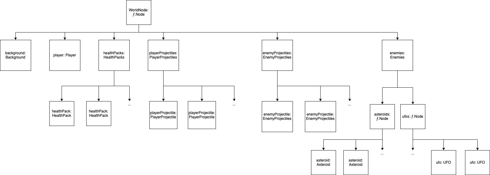

# Prima
Repository for the module "Prototyping interactive media-applications and games" at Furtwangen University

[Pages-Version](https://paradoxmike.github.io/PRIMA-SoSe21/)
[Repo-Version](https://github.com/ParadoxMike/PRIMA-SoSe21)

- [DoodleSpace](https://paradoxmike.github.io/PRIMA-SoSe21/DoodleSpace/index.html) Note: only works in a Chromium Browser

## Checkliste für Leistungsnachweis

| Nr | Bezeichnung           | Inhalt                                                                                                                                                                                                                                                                         |
|---:|-----------------------|--------------------------------------------------------------------------------------------------------------------------------------------------------------------------------------------------------------------------------------------------------------------------------|
|    | Titel                 | DoodleSpace
|    | Name                  | Mike Blank
|    | Matrikelnummer        | 259490
|  1 | Nutzerinteraktion     | Steuerung des Schiffs mit der Tastatur --> W,A,S,D um das Schiff entsprechend nach rechts, links, oben und unten zu bewegen. Die Leertaste wird zum abfeuern der Raumschiffkanone verwendet. Vornehmen von Einstellungen und Starten des Spiels mit der Maus.                  |
|  2 | Objektinteraktion     | Das Raumschiff interagiert mit den Gegnern, den gegnerischen Projektilen und den HealthPacks. Die Gegner wiederum interagieren mit den Projektilen des Spielers.                                                                                                               |
|  3 | Objektanzahl variabel | Alle Objekte werden die den Bildschirm verlassen werden gelöscht. Also Gegner und Projektile. Außerdem werden Objekte gelöscht deren HP auf 0 fällt (definiert in BaseEntity.ts), beispielsweise ein Projektil das auf einen Gegner trifft. Zur Laufzeit werden außerdem Gegner rechts außerhalb des Bildschirms generiert sowie Projektile rechts neben dem Spieler bzw. Links neben den UFOs.|
|  4 | Szenenhierarchie      | Es existiert eine WorldNode welche an den Viewport weitergegeben wird. Alle anderen Nodes sind Kinder dieser Node. Siehe Diagramm unten.                                                                                                                                       |
|  5 | Sound                 | Es gibt einen Backgound Track der im Loop läuft, außerdem existieren Sounds fürs abfeuern der Schiffskanone, das Erleiden von Schaden, das Treffen eines Gegners und das Aufsammeln eines Health Packs                                                                         |
|  6 | GUI                   | Das GUI umfasst die Möglichkeit vor Spielstart zu entschieden ob der Sound aktiviert sein soll und welcher Schwierigkeitsgrad gewünscht ist. Außerdem werden dem Spieler ständig die verbleibenden HP angezeigt sowie die Möglichkeit das eines Reset nach einem Game Over.    |
|  7 | Externe Daten         | In einer JSON Datei befinden sich alle wichtigen einstellbaren großen wie die Spawnhäufigkeit von Gegnern, Schussfrequenz etc. Diese Werte entsprechen denen des Schwierigkeitsgrades NORMAL und werden bei Auswahl eine höheren Schwierigkeitsgrades teilweise überschrieben. |
|  8 | Verhaltensklassen     | Für alle sichtbaren Elemente existiert eine modifizierte Eltern Klasse (BaseEntity.ts) welche Funktionalität wie Kollisionserkennung, eine Textur oder die Möglichkeit einen Sound abzuspielen mit sich bringt. Die Klasse Player ist ein direktes Kind von BaseEntity und implementiert zusätzliche Methoden zu Erkennung von Tastatureingaben, alle anderen Kinder Klassen wie EnemyProjektile, UFO, etc. Begnügen sich mit den bereits vorhandenen Methoden und werden stattdessen von einer übergeordneten Kontrollklasse gesteuert welche ein Kind von ƒ.Node ist. So sind beispielsweise alle Gegner in der Klasse Enemies zusammengefasst und werden mit der Methode .handleMovement(_speed: number) bewegt. Außerdem übernehmen diese übergeordneten Kontrollklassen auch auch das Erzeugen neuer Instanzen von beispielsweise UFO mit eigenen Methoden. Die Auswahl zufälliger Orte für das erzeugen der Gegner übernimmt jedoch eine völlig eigenständige Klasse Spawner. Diese generiert zufällige Koordinaten für das Erzeugen der Gegner und ruft dann die Spawn-Methoden der Kontrollklasse auf. Das gleiche Paradigma, minus der Spawner-Klasse gilt auch für HealthPaks, Spieler Projektile und Gegner Projektile. Hier wird das aufrufen der Spahn-Methode von der Enemies oder der Player Klasse übernommen.|
|  9 | Subklassen            | siehe Punkt 8 |
| 10 | Maße & Positionen     | Der Ursprung des Koordinatensystems liegt am Linken Bildrand in der Mitte, so das Sich das Raumschiff initial auf X:1.5 und Y:0 befindet. Das Raumschiff ist in Y: Richtung 1 hoch, sämtliche Andere Größen beziehen sich darauf. So ist ein Asteroid beispielsweite 1x1 Einheiten groß.|
| 11 | Event-System          | Das Event-System wird verwendet um das Klicken der beiden Buttons abzufangen und so das Spiel zu starten bzw. einen Reset durchzuführen.                                                                                                                                                                                |

