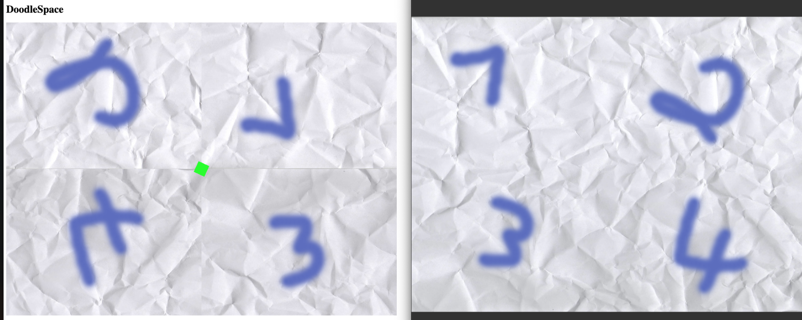

Textur verhalten sollte direkt sichtbar sein da zurzeit aktiv d.h. anzeige sollte unter Windows defekt sein. Workaround ist in Background.ts Zeile 24-28. 
Nicht rendern der Texturen bei fehlender Node mit ƒ.ShaderUniColor kann durch auskommentieren von Zeile 20 in main.ts überprüft werden (worldNode.addChild(generateDummy());)

Lokaler Screenshot:
